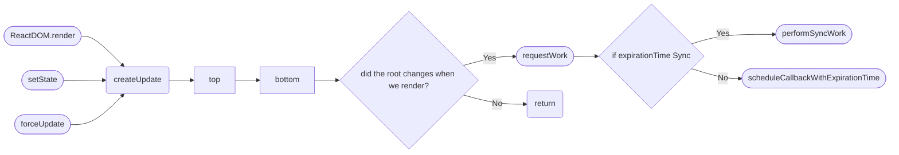

# Understanding React Source Code
 
> I have finished writing most part of this book, and I will continue to update and polish this book as I go.

Before I write this book, I have already spent about a month to read the source code of React. Before I started it, I have never thought this is something difficult. I only found out it wasn't that simple since I started reading it.

Understanding why you want to read source code before you start is critical. You are probably guessing why the creator designed it in this way. But an open source framework is rather different than a normal frontend web app, thus their design philosophy.

You simply can't think about them in the same way. Let alone mentioning it might be a skill issue for me to understand them, since I have almost never written library code. I was absolutely lost when I tried to dog food them. For example, when I saw the design of `TypeofMode` in `React Fiber`:
```typescript
export const NoContext = 0b000;
export const AsyncMode = 0b001;
export const StrictMode = 0b010;
export const ProfileMode = 0b100;
```
I didn't realise they designed it to simplify the component/function types, and their consolidating direction. If I have any prior exposure to complex authorisation system design, I would have realised it immediately.

Taking another example, as a frontend engineer, I didn't study deep into algorithms or data structures, so when I saw `firstEffect.nextEffect`, or `lastEffect` I didn't understand what it meant and what was it for. (It was a type of design pattern called `linked list`, a linear collection of data elements whose order is not given by their physical placement in memory[<sub>wikipedia</sub>](https://en.wikipedia.org/wiki/Linked_list)).

Lmao, I just want to reiterate what I have learnt while reading React's source code in prelude. Reading source code doesn't just help you deeply understand the design philosophy of a framework, but also helping you achieve "What's the better way to do X".

In the world of programming, we will regress if we don't progress right?

## 3 core ideas in React
Let's go back to the business, I concluded the core ideas of React into 3 parts:
- How they handle updates
- What's `Fiber` and what was it for
- Dynamic routing, tasks update and scheduling in React, and how they achieve it (TODO: This should has a better way to say it)

I'd consider these three ideas are the most difficult to understand.

The website you are looking at right now is somewhat similar to a notebook, they are jotted down when I was reading the source code. I found this "Left pane for note taking, right pane for source code" +  Gitbook very comfortable for both reading and writing.

I am still combing through the whole idea and try to display the least amount of source code in order to understand the key concepts in React. For people who doesn't have a lot of time to sit down and read, I guess it might be a good way to split them into chunks and read them in your spare time. At this end I might explain the conclusion in a fashion of either:
- PDFs
- Videos

## How React schedule tasks
Before we start, I want to show you a graph:

Place holder below to test iframe in Nextra

<iframe src="https://link.excalidraw.com/readonly/VoZilnaVslWU4Kd1s4V4?darkMode=true" width="100%" height="50%"></iframe>